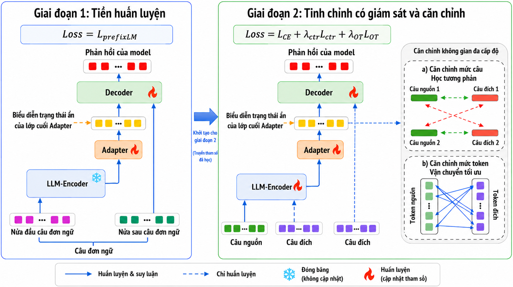

# Multilevel Semantic Alignment for Low-Resource Multilingual Machine Translation

<p align="center">
  
  
  
  
</p>

<div align="center">
<p align="center" dir="auto">

• 📄 [Introduction](#-introduction)
• 🧩 [Model Architecture](#-model-architecture)
• 🚀 [Quick Start](#-quick-start)
</p>
<p align="center" dir="auto">

• 🔥 [Training](#-training)
• ⚡ [Inference](#-inference)
• 📊 [Evaluation](#-evaluation)
</p>
</div>

# 📄 Introduction

This project investigates **multilingual machine translation for low-resource languages** using a hybrid **LLM–Encoder–Adapter–Decoder** architecture. The approach combines the strong multilingual semantic representations of a large language model with the source-conditioned generation capability of a neural machine translation decoder.

The model uses **Sailor2-1B-Chat** as the LLM encoder and the decoder of **NLLB-200-distilled-600M** for translation generation. Because the representation spaces of these two pretrained models are not directly compatible, an intermediate Adapter is introduced to aggregate, transform, and contextualize the encoder representations before they are passed to the translation decoder.

To reduce cross-lingual representation discrepancy, the project applies a multilevel semantic alignment mechanism:

- **Sentence-level alignment** uses a contrastive objective to bring semantically equivalent bilingual sentences closer in the representation space.
- **Token-level alignment** uses entropy-regularized Optimal Transport to establish soft correspondences between source and target token representations.

The model is trained using a two-stage procedure. The first stage initializes the connection between the frozen LLM encoder and NMT decoder by training the Adapter on bilingual data. The second stage fine-tunes the translation system while jointly optimizing translation quality and multilingual semantic alignment.

**Key features**

- Hybrid LLM–NMT architecture for low-resource multilingual translation.
- Sailor2-based encoder specialized for Southeast Asian languages.
- Adapter with hidden-layer fusion, nonlinear projection, and bidirectional contextualization.
- Two-stage training procedure for stable cross-model adaptation.
- Sentence-level contrastive alignment and token-level Optimal Transport alignment.

# 🧩 Model Architecture



The proposed model contains three main components:

| Component | Description |
|---|---|
| LLM Encoder | Sailor2-1B-Chat encodes the source sentence and provides multilingual contextual representations. |
| Adapter | Aggregates selected LLM hidden states, projects them into the decoder hidden space, and refines them with bidirectional contextual modeling. |
| NMT Decoder | Decoder generates the target translation using cross-attention over the adapted encoder representations. |

The overall training objective in the second stage is:

```text
L = L_CE + lambda_sen * L_sentence + lambda_tok * L_token
```

where:

- `L_CE` is the translation cross-entropy loss.
- `L_sentence` is the sentence-level contrastive loss.
- `L_token` is the token-level Optimal Transport alignment loss.
- `lambda_sen` and `lambda_tok` control the contributions of the alignment objectives.

# 🚀 Quick Start

Run all commands from the repository root.

Set the Python path and create the required output directories:

```bash
export PYTHONPATH=$PWD/src
mkdir -p cache
mkdir -p exps
```

Install the main dependencies:

```bash
pip install torch transformers datasets peft accelerate wandb \
    sacrebleu pandas tqdm unbabel-comet
```

The complete workflow consists of four commands:

```bash
bash scripts/train_sailored.stage1.sh
bash scripts/train_sailored.stage2.sh
bash scripts/inference.sh
python src/qwen/evaluate/bleu.py --input /path/to/eval.csv
python src/qwen/evaluate/comet.py \
    --input /path/to/eval.csv \
    --output /path/to/comet_result.csv
```

# 🔥 Training

Training is divided into two stages.

## Stage 1: Adapter warm-up

In the first stage:

- The LLM encoder is frozen.
- The NMT decoder is frozen.
- Only the Adapter is trained.
- Cross-entropy loss is used to teach the decoder how to consume the transformed LLM representations.

Edit [scripts/train_sailored.stage1.sh](scripts/train_sailored.stage1.sh) and configure:

- `model_dir`
- `mmt_data_path`
- `language_pairs`
- `output_dir`
- batch size and optimization parameters

Then run:

```bash
bash scripts/train_sailored.stage1.sh
```

This script launches:

```text
src/qwen/training/train_sailored.py
```

with:

```text
run_mode=init
```

## Stage 2: Translation fine-tuning and semantic alignment

In the second stage:

- LoRA is applied to the LLM encoder.
- The Adapter and NMT decoder are fine-tuned.
- Translation loss is optimized jointly with sentence-level and token-level alignment losses.

Edit [scripts/train_sailored.stage2.sh](scripts/train_sailored.stage2.sh) and set:

- `model_dir` to the Stage 1 checkpoint or output directory
- `mmt_data_path`
- `language_pairs`
- `output_dir`
- `lambda_sen`
- `lambda_tok`
- Optimal Transport and contrastive-learning hyperparameters

Then run:

```bash
bash scripts/train_sailored.stage2.sh
```

This stage uses:

```text
run_mode=sft
```

and continues training from the Stage 1 model.

## Data format

Each line of the training data should be a JSON object. A general translation sample can follow this structure:

```json
{
  "src_lang": "vi",
  "tgt_lang": "en",
  "translation": {
    "vi": "Năm 2015, khoảng 5% dân số đã sử dụng ma túy bất hợp pháp ít nhất một lần.",
    "en": "In 2015, about 5% of the population had used illegal drugs at least once."
  },
  "data_name": "OPUS",
  "task_type": "general_trans"
}
```

The training data should maintain consistent language codes, translation directions, and task labels.

# ⚡ Inference

Edit [scripts/inference.sh](scripts/inference.sh) and update:

- `model_dir` to the final trained model directory
- `mmt_data_path`
- `language_pairs`
- `output_dir`
- decoding parameters such as `num_beams`, `max_new_tokens`, and `no_repeat_ngram_size`

Then run:

```bash
bash scripts/inference.sh
```

Inference results are saved under:

```text
exps/<tag>/decode_result/
```

Example prediction files:

```text
test-km-vi-general_trans
test-lo-vi-general_trans
```

A typical generation configuration is:

```text
num_beams=5
max_new_tokens=400
no_repeat_ngram_size=3
do_sample=false
```

# 📊 Evaluation

The evaluation scripts expect a CSV file containing at least the following columns:

| Column | Description |
|---|---|
| `src` | Source sentence |
| `tgt` | Reference translation |
| `prediction` | Model-generated translation |

Example:

```csv
src,tgt,prediction
"Xin chào","Hello","Hi"
```

## BLEU

Use [src/qwen/evaluate/bleu.py](src/qwen/evaluate/bleu.py):

```bash
python src/qwen/evaluate/bleu.py \
  --input /path/to/eval.csv \
  --prediction-column prediction \
  --reference-column tgt \
  --start-index 0 \
  --tokenize 13a
```

You can also use:

```bash
bash scripts/bleu.sh
```

After updating the input path in the script.

## COMET

Use [src/qwen/evaluate/comet.py](src/qwen/evaluate/comet.py):

```bash
python src/qwen/evaluate/comet.py \
  --input /path/to/eval.csv \
  --output /path/to/comet_result.csv \
  --model Unbabel/wmt22-comet-da \
  --batch-size 128
```

Use CPU mode when a GPU is unavailable:

```bash
python src/qwen/evaluate/comet.py \
  --input /path/to/eval.csv \
  --output /path/to/comet_result.csv \
  --cpu
```

You can also use:

```bash
bash scripts/comet.sh
```

After updating the input and output paths.

# 📁 Expected Outputs

After completing the workflow, the repository should contain:

```text
exps/<tag>/
├── train.log
├── checkpoint-*/
├── decode_result/
│   ├── test-km-vi-general_trans
│   └── test-lo-vi-general_trans
└── evaluation/
    └── comet_result.csv
```

The expected outputs include:

- training logs in `exps/<tag>/train.log`
- model checkpoints in `exps/<tag>/checkpoint-*`
- generated translations in `exps/<tag>/decode_result/`
- corpus-level BLEU printed to the terminal
- sentence-level COMET scores saved to CSV
- average COMET score printed to the terminal

# 📚 Research Scope

The current implementation focuses on multilingual translation involving Vietnamese and several Southeast Asian low-resource languages, including Khmer, Lao, Thai, and Burmese. The architecture is designed to examine whether multilingual knowledge from an LLM encoder can be effectively transferred to a pretrained NMT decoder through intermediate representation adaptation and multilevel semantic alignment.

The implementation can also be extended to:

- additional low-resource language pairs
- alternative multilingual LLM encoders
- different pretrained NMT decoders
- adaptive hidden-layer selection
- token-importance weighting for Optimal Transport
- phrase-level or hierarchical semantic alignment

# Citation

A formal citation entry will be added when the associated thesis or paper is publicly available.
